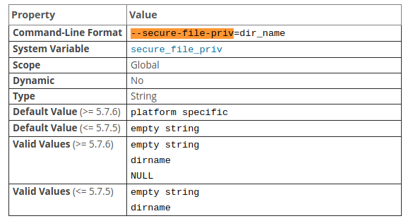

使用`? select`查看手册,该语句支持导出表数据到文件.  
比如`select * from tbl_name into outfile 'file_path';`  
但在ubuntu安装的mysql5.7中无法成功,提示以下错误:  
```
ERROR 1290 (HY000): The MySQL server is running with the --secure-file-priv option so it cannot execute this statement
```  

查看`mysql reference manual`中`5.1.7`中系统变量章节,搜索`--secure-file-priv`.  
  
以下是三个候选值的说明:  
- `empty string`:表示导入导出目录没有任何限制;这是不安全的操作;  
- `dirname`:限制导入导出的目录;  
- `NULL`:表示禁止导入导出的操作;  

查看当前数据库变量`secure-file-priv`的变量值:  
`show variables like '%secure%';`  
```
+--------------------------+-----------------------+
| Variable_name            | Value                 |
+--------------------------+-----------------------+
| require_secure_transport | OFF                   |
| secure_auth              | ON                    |
| secure_file_priv         | /var/lib/mysql-files/ |
+--------------------------+-----------------------+
```  
默认值是安全且推荐的,故导出的时候,使用类似下面的语句:  
```
select * from tbl_name into outfile '/var/lib/mysql-files/tbl_name.db';`
```  
