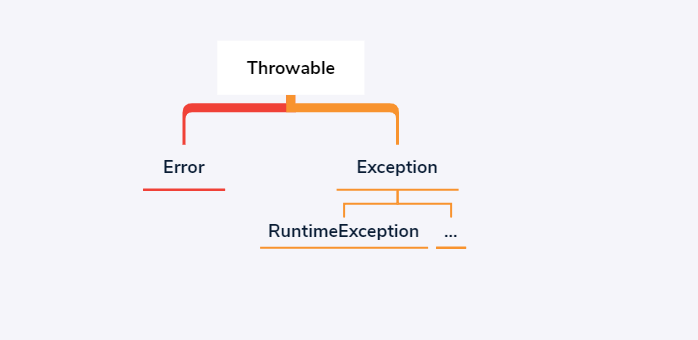

异常机制概述:  
1. 异常的分类;  
1. 异常的处理:抛出异常+捕获异常;  
1. JDK7对异常机制的改进:try语句+catch语句;  
1. fianlly子句;  

---

异常的分类:
- 受检查型异常;  
- 非受检查型异常;  

异常的继承体系:  
  

规范:  
Java语言规范中,将派生于`Error`和`RuntimeException`的异常,定义为非受检查型异常.  
其他的异常,则称之为受检查型异常.  

目的:  
对于受检查型异常,在程序中,是强制要求提供异常处理器的.  

---

对于受检查型异常,提供异常处理器的方式有两种:  
- 一是抛出异常处理,使用`throws`关键字;  
- 一是捕获异常处理,使用`try-catch`或之`try-catch-fianlly`语句,再配合`throw`关键字.  

_抛出异常:_  
```java
package ocn.axy.run;
public class App {
	// 该方法执行过程中遇到的任何异常，都会抛出，即抛出到上层。
	public void function() throws Exception {
		// to-do
	}
}
```  

_捕获异常:_:  
```java
package ocn.axy.run;
public class App {
	/*
	 * try-catch语句捕获异常。
	 * 对于异常信息，进行内部的压制处理。
	 */
	public void m1() {
		try {
			// to-do
		} catch (Exception e) {
			// handler-exception
		}
	}
	/*
	 * try-catch-finally语句捕获异常。
	 * 1）异常的信息，内部压制处理。
	 * 2)对于存在安全问题的操作，在fianlly内部处理，比如资源释放等。
	 */
	public void m2() {
		try {
			// to-do
		} catch (Exception e) {
			// exception-handler
		} finally {
			// safe-handler
		}
	}
	/*
	 * try-catch语句配合throw关键字
	 * 对于捕获的异常，内部不压制处理，采取向上请求处理的策略。
	 */
	public void m3() throws Exception {
		try {
			// to-do
		} catch (Exception e) {
			throw new Exception();
		}
	}
}
```  

---

JDK7对异常机制的改进:  
1. 支持带有资源的try语句,涉及IO操作的时候,使用该语法,不必再`finally`子句中特意的释放资源了.  
   提升了代码的简洁度.  
1. 对于单一一个`catch`子句,支持捕获多个异常.注意此种语法中声明的异常类型默认使用了`final`进行修饰.  

_带有资源的try语句:_  
```java
package ocn.axy.run;
import java.io.ByteArrayInputStream;
import java.io.IOException;
import java.io.InputStream;
public class App {
	public void $1() {
		InputStream in = new ByteArrayInputStream(null);
		try {} finally {
			try {
				in.close();
			} catch (IOException e) {
				e.printStackTrace();
			}
		}
	}
	public void $2() throws IOException {
		try (InputStream in = new ByteArrayInputStream(null)) {}
	}
}
```  

_catch子句捕获多个异常:_  
```java
package ocn.axy.run;
// 演示语法结构，但使用的捕获异常体系是不规范的
public class App {
	public void $1() {
		try {} catch (Exception e) {
			// TODO: handle exception
		} catch (Error e) {
			// TODO: handle exception
		}
	}
	public void $2() {
		try {} catch (Exception | Error e) {
			// The parameter e of a multi-catch block cannot be assigned
			// e = new IOException();// ERROR
		}
	}
}
```  

---

`finally`子句:方法体中的try语句执行结束或之抛出异常后执行.  
```java
package ocn.axy.run;
public class App {
	public int function() {
		try {
			return 2;
		} finally {
			return 1;
		}
		// Unreachable code
		// return 0;// ERROR
	}
	public static void main(String[] args) {
		int get = new App().function();
		System.out.println(get);// out:1
	}
}
```  
