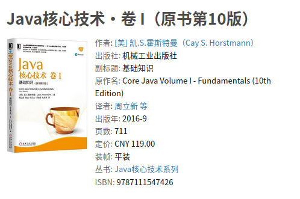

以下是摘录`Java核心技术`卷1第10版,第`14.5.7`章节:  

---

&#8195;&#8195;锁和条件是线程同步的强大工具，但是，严格地讲，它们不是面向对象的。多年来，研究人员努力寻找一种方法，可以在不需要程序员考虑如何加锁的情况下，就可以保证多线程的安全性。最成功的解决方案之一是监视器（`monitor`),这一概念最早是由`PerBrinchHansen`和`TonyHoare`在20世纪70年代提出的。用`Java`的术语来讲，监视器具有如下特性：  
- 监视器是只包含私有域的类。  
- 每个监视器类的对象有一个相关的锁。  
- 使用该锁对所有的方法进行加锁。换句话说，如果客户端调用`obj.method()`,那么`obj`对象的锁是在方法调用开始时自动获得，并且当方法返回时自动释放该锁。因为所有的域是私有的，这样的安排可以确保一个线程在对对象操作时，没有其他线程能访问该域。  
- 该锁可以有任意多个相关条件。  

&#8195;&#8195;监视器的早期版本只有单一的条件，使用一种很优雅的句法。可以简单地调用`await accounts[from]>=balance`而不使用任何显式的条件变量。然而，研究表明盲目地重新测试条件是低效的。显式的条件变量解决了这一问题。每一个条件变量管理一个独立的线程集。  
&#8195;&#8195;`Java`设计者以不是很精确的方式采用了监视器概念，`Java`中的每一个对象有一个内部的锁和内部的条件。如果一个方法用`synchronized`关键字声明，那么，它表现的就像是一个监视器方法。通过调用`wait/notify/notifyAll`来访问条件变量。  
&#8195;&#8195;然而，在下述的3个方面`Java`对象不同于监视器，从而使得线程的安全性下降：  
- 域不要求必须是`private`。  
- 方法不要求必须是`synchronized`。  
- 内部锁对客户是可用的。  

&#8195;&#8195;这种对安全性的轻视激怒了`PerBrinchHansen`。他在一次对原始`Java`中的多线程的严厉评论中，写道：“这实在是令我震惊，在监视器和并发`Pascal`出现四分之一个世纪后，`Java`的这种不安全的并行机制被编程社区接受。这没有任何益处。”`[Java’s Insecure Parallelism, ACM SIGPLAN Notices 34:38-45, April 1999.]`  

